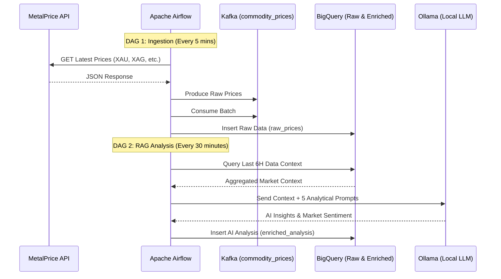

# Precious Metals RAG Pipeline

**Automated, AI-driven market analysis for Precious Metals (Gold, Silver, Platinum, Palladium)** using Apache Airflow, Kafka, Google BigQuery, and Local LLMs (Ollama) for Retrieval-Augmented Generation (RAG).



##  Project Overview

This portfolio project demonstrates an advanced **End-to-End Data Engineering & AI Pipeline**. It moves beyond basic ETL by integrating **Retrieval-Augmented Generation (RAG)** directly into the data flow.

### What it does:
* **Extracts** live spot prices for Gold, Silver, Platinum, and Palladium every 5 minutes from the MetalPrice API.
* **Streams & Buffers** the raw data through a local **Apache Kafka** cluster.
* **Loads** the historical time-series data into **Google BigQuery**.
* **Analyzes (RAG)** the market automatically every hour. Airflow pulls the recent BigQuery context, feeds it to a local LLM via **Ollama**, and asks 5 specific financial questions (trend analysis, volatility, anomalies).
* **Stores** the AI-generated insights back into BigQuery for visualization and reporting.
* **Orchestrates** everything using **Apache Airflow** running entirely in Docker.

---

##  Technologies & Rationale

| Layer | Technology | Why chosen? |
| :--- | :--- | :--- |
| **Orchestration** | Apache Airflow | Industry standard for DAG scheduling, dependencies, and retry logic. |
| **Streaming Broker** | Apache Kafka | Decouples extraction from loading; ensures no data is lost during BQ outages. |
| **Data Warehouse** | Google BigQuery | Highly scalable serverless OLAP; perfect for time-series and AI context lookups. |
| **Generative AI / RAG** | Ollama (Llama 3) | Free, local, and private LLM inference directly within the Docker network. |
| **Infrastructure** | Docker Compose | Ensures reproducible environments across dev and prod without local dependency hell. |
| **Language** | Python 3 | Native support for Airflow, Kafka clients, and Google Cloud SDKs. |

---

##  How to Run – Step-by-Step (Clean Slate Guide)

### Prerequisites
* **Docker & Docker Compose** installed and running.
* **Google Cloud Project** with the BigQuery API enabled.
* **GCP Service Account JSON Key** (Roles needed: BigQuery Data Editor, BigQuery Job User).
* **MetalPrice API Key** → [Sign up here](https://metalpriceapi.com/)

## Step 1 – Clone the repository
```bash
git clone [https://github.com/YOUR_USERNAME/precious-metals-rag-pipeline.git](https://github.com/YOUR_USERNAME/precious-metals-rag-pipeline.git)
cd precious-metals-rag-pipeline
```

## Step 2 – Set up Environment Variables & GCP Key
### Copy the example environment file:
```bash
cp .env.example .env
```
### Open .env and configure your keys:
```python
# Required APIs
METALPRICE_API_KEY=your_api_key_here
GCP_PROJECT_ID=your_gcp_project_id

# Airflow Settings
AIRFLOW_UID=50000
AIRFLOW_PROJ_DIR=.
```
## Step 3– Launch the Stack
### Start all services (Kafka, Postgres, Airflow Webserver/Scheduler, Ollama) in the background:
```bash
docker compose up -d
```

## Step 4 – Verify & Enable DAGs
1. **Access Airflow UI:** Open [http://localhost:8081](http://localhost:8081) (Login: `admin` / `admin`).
2. **Access Kafka UI:** Open [http://localhost:8080](http://localhost:8080) (Verify the `commodity_prices` topic exists).
3. **Enable DAGs:** In the Airflow UI, toggle the following DAGs to **"On"**:
    * `fetch_precious_metals_prices` (Runs every 5 minutes)
    * `enrich_precious_metals_with_rag` (Runs every 30 minutes)
  
##  Data Modeling & BigQuery Architecture

The pipeline follows a tiered data architecture, utilizing **Partitioning** and **Clustering** in Google BigQuery to optimize for performance and cost.

### 1. `raw_prices` (Raw Layer)
Optimized for high-frequency time-series ingestion and recent window lookbacks (e.g., last 6 hours of context for RAG).

| Column | Type | Description |
| :--- | :--- | :--- |
| `event_id` | **STRING** | Unique UUID for deduplication and audit traceability. |
| `metal` | **STRING** | Metal symbol: XAU, XAG, XPT, XPD. |
| `price_usd` | **FLOAT64** | Spot price in USD (captured at 5-minute intervals). |
| `api_timestamp` | **TIMESTAMP** | Market time exactly as reported by the upstream API. |
| `ingestion_timestamp` | **TIMESTAMP** | Time the record was produced to the Kafka cluster. |
| `processed_at` | **TIMESTAMP** | Time the Python Consumer successfully wrote the record to BigQuery. |
| `airflow_run_id` | **STRING** | Originating Airflow DAG Run ID for end-to-end lineage. |

* **Partitioning:** `DATE(ingestion_timestamp)` — Enables cost-efficient queries by scanning only relevant days.
* **Clustering:** `metal` — Optimizes performance for commodity-specific analysis and RAG context retrieval.

---

### 2. `enriched_analysis` (Enriched Layer)
Optimized for RAG reporting and grouping analysis by session.

| Column | Type | Description |
| :--- | :--- | :--- |
| `run_id` | **STRING** | UUID grouping all 5 questions from the same LLM session. |
| `run_at` | **TIMESTAMP** | Execution time of the RAG task. |
| `question` | **STRING** | The analytical prompt sent to Ollama. |
| `answer` | **STRING** | The factual response from the local LLM (llama3.2). |
| `data_window_start` | **TIMESTAMP** | Earliest data point used for RAG context. |
| `data_window_end` | **TIMESTAMP** | Latest data point used for RAG context. |

* **Partitioning:** `DATE(run_at)` — Organizes AI insights by date.
* **Clustering:** `run_id` — Allows for fast retrieval of a full analysis session.

## 📊 Sample RAG Analysis Output
Below is a real-world example of the high-level reasoning performed by the **Llama 3.2** model.

| Analytical Question | LLM Reasoning & Response |
| :--- | :--- |
| **1. Identify any volatility spikes (>0.3% change) in the provided data. Describe if these moves appear coordinated across all metals or isolated to one.** | "Volatility spikes (>0.3% change): **None detected** in the provided data." |
| **2. Compare the market behavior between the first half and second half of this session. Specifically for Gold (XAU), is the momentum accelerating or cooling down?** | "Market behavior comparison: Gold (XAU) shows a steady increase, but its **momentum appears to be cooling down** as the session progresses." |
| **3. Identify any metals currently 'decoupled' from the general market trend. Based on this, what is the overall market sentiment (Risk-On/Risk-Off)?** | "Decoupled metals: **XPD (Palladium)** is currently 'decoupled' from the general market trend. Overall market sentiment: **Risk-Off** due to the lack of significant volatility spikes and the cooling-down momentum in Gold." |
| **4. Analyze the Gold-to-Silver (XAU/XAG) ratio trajectory. What does this suggest about Silver's relative strength in this session?** | "The ratio has been steadily increasing, suggesting that **Silver's relative strength is growing** compared to Gold." |
| **5. Final Summary: Assign a trend (UP/DOWN/SIDEWAYS) to each metal, justifying it with the price discovery observed from start to end.** | **XAG:** SIDEWAYS <br> **XAU:** COOLING DOWN <br> **XPD:** SIDEWAYS <br> **XPT:** SIDEWAYS <br><br> *Justification:* XAU’s early increase is fading into potential consolidation; XPD is moving independently of the broader market trend, while XAG and XPT remain directionless. |

---

### 🧠 How it Works: RAG Orchestration
1. **Context Retrieval:** The system fetches raw price points and pre-calculated SQL metrics (Session % Change) from BigQuery.
2. **Vector Embedding:** Data is converted into embeddings using `nomic-embed-text` and stored in a local FAISS index.
3. **Augmented Generation:** The LLM (Llama 3.2 via Ollama) receives the top 15 most relevant price context chunks.
4. **Structured Parsing:** A custom Python Regex parser breaks the LLM's natural language response into structured rows to prevent "row-shifting" and ensure 1:1 mapping between questions and answers in BigQuery.
